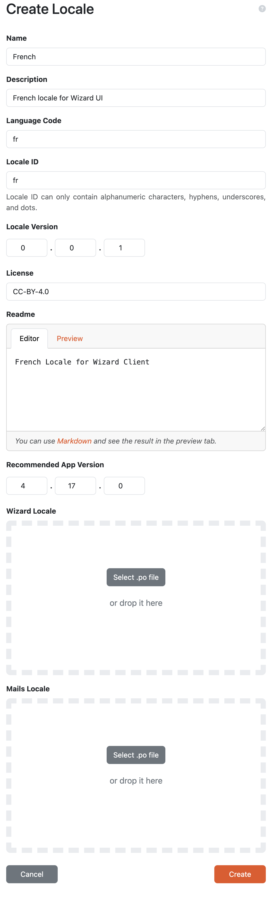

Create Locale
*************

We can create a new locale directly in |project_name| by pressing :guilabel:`Create` from :doc:`./index`. We need to fill the details about the new locale such as name, description, language code (`RFC5646 <https://www.rfc-editor.org/rfc/rfc5646.html>`__, e.g. ``en`` or ``en-GB``), locale ID, locale version, license, README (with Markdown syntax), and recommended app version. The recommended app version captures for which version of the |project_name| is this locale intended and compatible with (it can be used in other versions as well but may have some untranslated texts).

Finally, a PO file is requested from us. We can create such PO file in a standard (`gettext <https://www.gnu.org/software/gettext/>`__-based) way.

Similarly we can create a PO file for the emails.

The needed POT files are placed in the localization repository `wizard-locales <https://github.com/ds-wizard/wizard-locales>`__ (select the desired release and there is ``default.pot`` asset).

Recommended tool for creating the localization is the `Poedit <https://poedit.net/>`__.

    
    Form for creating a new locale.

