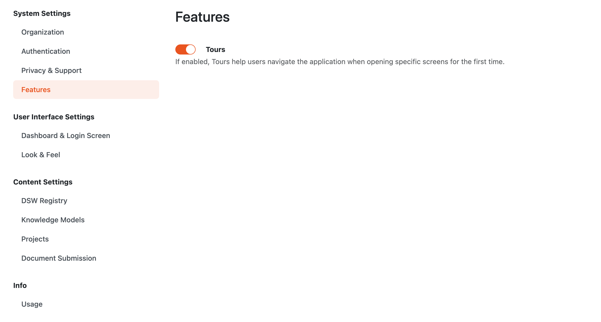

Tours
=====

Tours provide a way to guide users through the features of FAIR Wizard. Tours are defined on the code level so they are not configurable. However, you can enable or disable them in the settings. If tours are enabled, users can reset tours they have already completed in their user settings.

Tours are not displayed to anonymous users.

    Switch tours.

