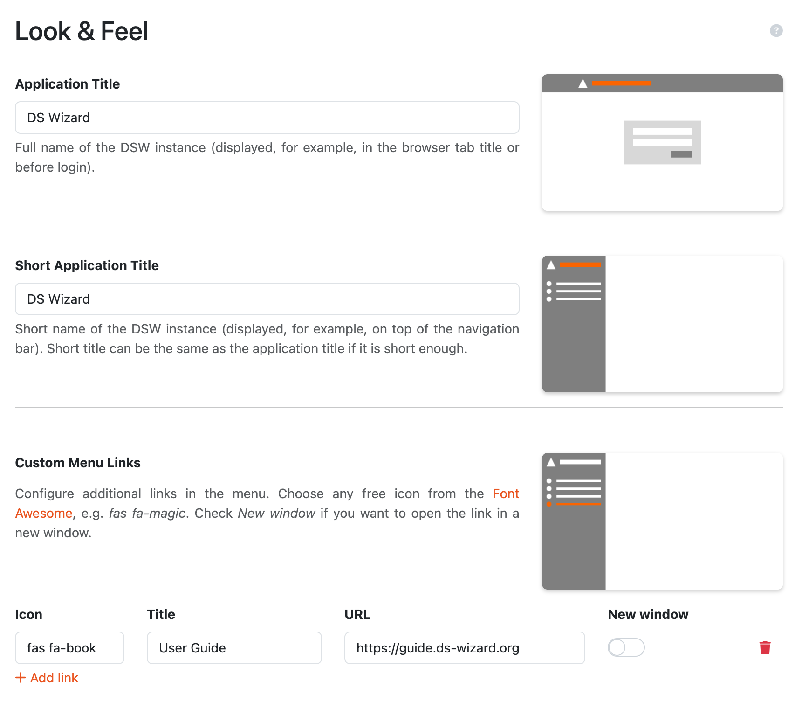

Look & Feel Settings
********************

This part of settings allows us to adjust how the |project_name| instance looks like. 

Application Titles
==================

There are two titles that we can set. First, **Application Title** is the full title that should identify the |project_name| instance, for example, in browser's tab. Second is **Short Application Title** which is visibile, for example, at the top of the main (left) menu next to the icon. We should keep **Short Application Title** really short (about 10 characters at maximum) so it fits well.

Custom Menu Links
=================

We can easily add custom links to the main (left) menu by clicking :guilabel:`Add` under **Custom Menu Links**. For each link, we can set **Icon** (from `Font Awesome <https://fontawesome.com/v5/search>`_), **Title** and the target **URL**. We can also set whether the link should open in **New Window** (if not, it will nagivate user directly in the same window/tab from |project_name| instance). Once the links are there, we can manage them or delete them at this place.

    
    Example configuration of a custom menu link.
    