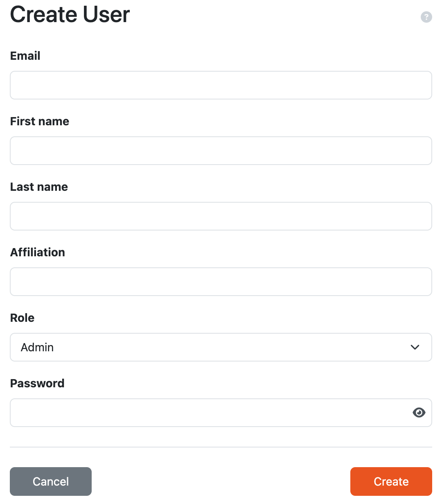

.. _user-create:

Create User
***********

Users with permission to manage users can create new users manually by clicking :guilabel:`Create` on the :ref:`users list<users-list>` and submitting the form. Each user must have a unique email address, first name and last name, assigned :ref:`role<roles>`, and a password. Optionally, a user can have affiliation specified.

    
    User creation form.

.. NOTE::

    If the user is created manually by a user manager, the user is activated by default and no email is sent to the user.
