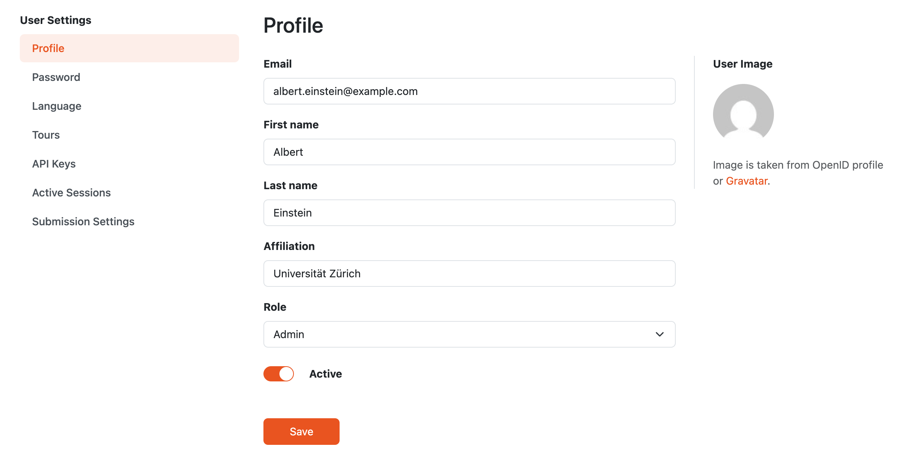
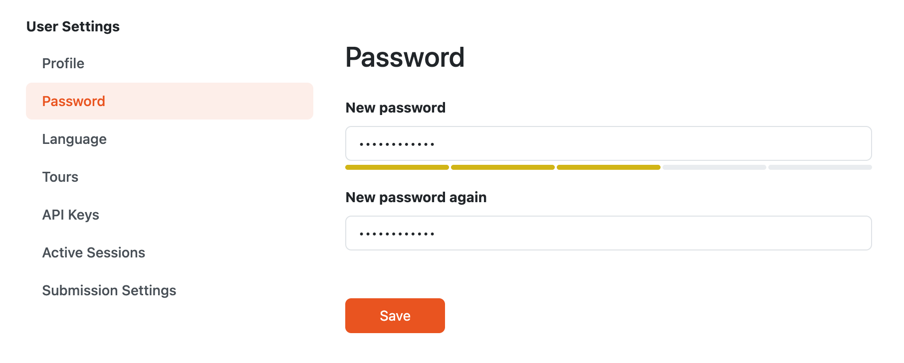

.. _user-detail:

User Detail
***********

Users with permission to manage users can edit existing users manually on the detail (selected user from the :ref:`users list<users-list>`). It is possible to change all properties of the user, including whether the user account is active or inactive.

    
    Detail of a user profile.

The password can be also changed (after selecting :guilabel:`Password` from the left navigation of user settings).

    
    Form for changing password of a user.

.. _user-roles:

User Roles
==========

Each user has one global :ref:`role<roles>`. The role determines which parts of the |project_name| instance the user can access and what actions they can perform.

Default roles cover the common researcher, data steward, and admin workflows. Users with permission to manage settings can also create custom roles when they need a different combination of permissions.

Changing the role of a user updates the permissions assigned to that user.
