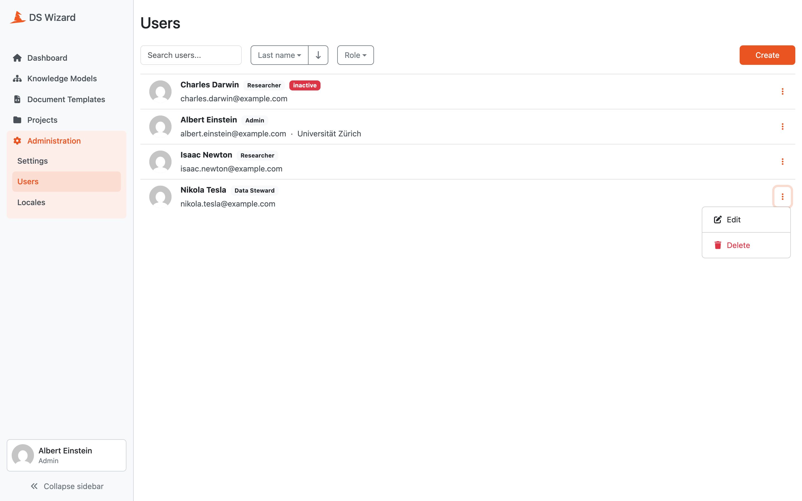

.. _users-list:

Users
*****

A users list allows users with permission to manage users to see and manage all users in a DSW instance. The list can be filtered using :ref:`roles<roles>`, searched by name or email fragment, and sorted via various user properties. The list shows the role of a user next to their name and also indicates when the user is inactive. Next to the email, we can quickly see what authentication services the user uses to log in.

A :ref:`user detail<user-detail>` can be opened by clicking the name of a user or by selecting :guilabel:`Edit` in the right dropdown menu for the desired row. There, a user can also be deleted via the :guilabel:`Delete` action. Finally, a new user can be :ref:`created<user-create>` by clicking :guilabel:`Create`.

    
    List of users.

----

.. raw:: html
    
    <h2>Table of Contents</h2>

.. toctree::
    :maxdepth: 2

    Create<create>
    Detail<detail>
