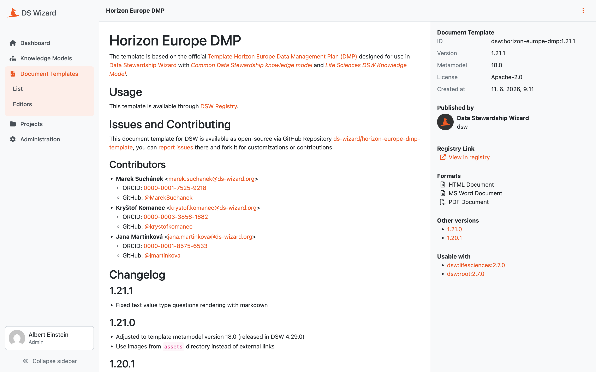

Document Template Detail
************************

We can check a document template detail by clicking on a desired template in the :doc:`./index` (or selecting :guilabel:`View detail` from the right dropdown). The detail shows basic information about the template such as its name, ID, version, license, metamodel version, creation date, or supported document formats.

The main part of the detail is the README of the template that should contain basic information and changelog for the template. In the right panel under the basic information, we can navigate to other versions of the document template, navigate to the `DSW Registry <https://registry.ds-wizard.org>`__ (if the template is present there), or check compatible knowledge model with the template.

In the top bar, we can :guilabel:`Export` the template as a ZIP package or :guilabel:`Delete` this version of the template (only if it is not already used for some documents). We can also quickly navigate to :doc:`../editors/create` by clicking :guilabel:`Create editor`; it will prepare editor creation for a new version of this document template. Finally, there is the possibility :guilabel:`Set deprecated` which will change the state of the document template so it is no longer usable by researchers in their projects (it becomes unavailable). This only applies to the latest version of the document template. If there is an older version, that will still be available.

If we are not seeing the latest version of the template, a warning message is shown in the top. Similarly, we will see a notification that update is available if there is a newer version in the `DSW Registry <https://registry.ds-wizard.org>`__ (if configured).

.. _document-template-locales:

Document Template Locales
=========================

A document template has a source language and can have locales for additional languages. The :guilabel:`Locales` tab lists each imported locale by name and language code. When the template is prepared for translations, use :guilabel:`Export .pot file` from its actions menu to obtain the source strings, translate them into a PO file, and use :guilabel:`Import` on the :guilabel:`Locales` tab to provide the locale name and PO file. Available actions also allow downloading or deleting an imported locale, subject to permissions.

The template's source language is shown in its detail panel. A locale becomes available when selecting a :ref:`default document language<default-document-template>` for a project or creating a document with that template.

    
    Detail of a document template.
