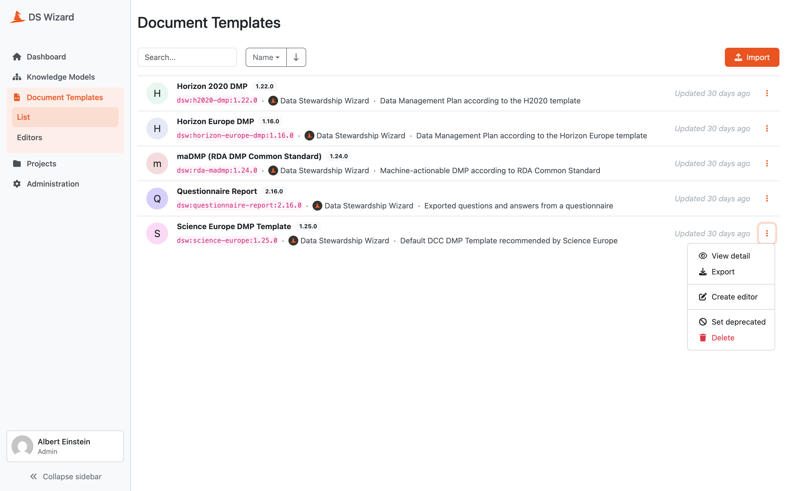

Document Template List
**********************

As **data stewards** and **admins**, we can check and manage all document templates from the list accessible from the main menu via :guilabel:`Document Templates`. The list can be filtered and sorted by name.

For each document template, we can see the latest version present; however, we can see all the versions by accessing the :doc:`./detail` by clicking the name of the template or via :guilabel:`View detail` from the right dropdown item menu. The dropdown menu also offers :guilabel:`Export` of the latest document template or :guilabel:`Delete` of entire template (all its versions).

.. NOTE::

    A document template can be deleted only if it is not used already for documents, projects, or settings.

Each item may be marked with :guilabel:`unsupported metamodel` when the document template is not compatible with the version of |project_name|. :doc:`../../../more/development/metamodel-schemas` are used to define structures that developers can interact with. If the template originates from the `DSW Registry <https://registry.ds-wizard.org>`__, :guilabel:`update available` badge will appear.

To see how to configure the registry, read the :ref:`FAQ and Deployment Notes<faq-unsupported-metamodel>`. If your template is not from the registry, you will have to :doc:`../editors/detail/publish` a new version via template editor, which will increase the metamodel version automatically.

Finally, we can use :guilabel:`Import` new document templates by clicking the top right button (see :doc:`./import` for details).

    
    List of all document templates with actions.

.. raw:: html
    
    <h2>Table of Contents</h2>

.. toctree::
    :maxdepth: 2

    Import<import>
    Detail<detail>
