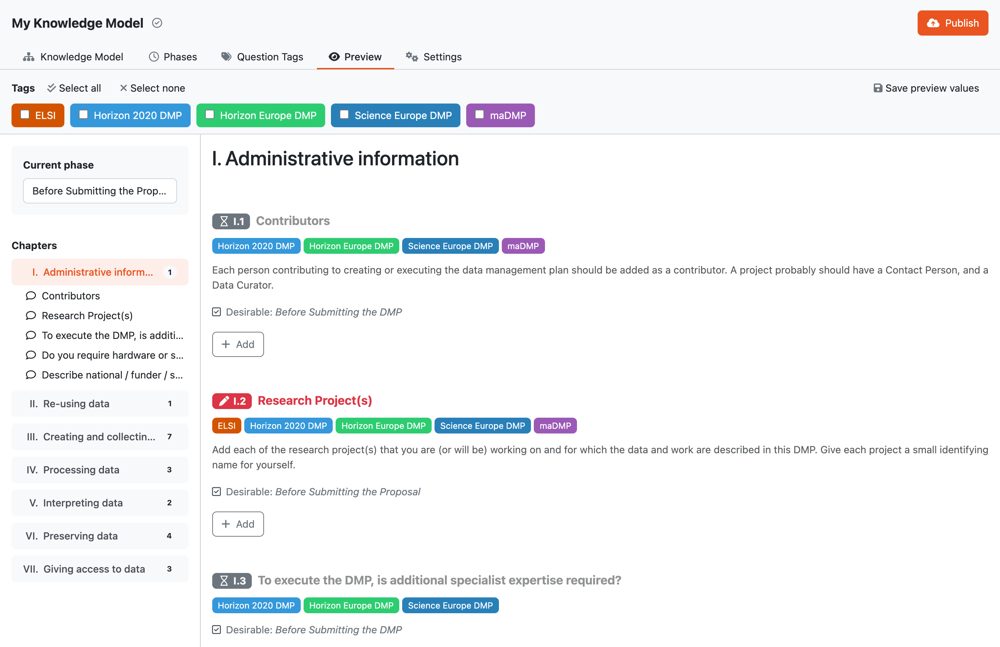

.. _km-editor-preview:

Preview
*******

We can use :guilabel:`Preview` tab to quickly see how the resulting questionnaire would look like. If there are any :ref:`question tags<question-tag>` set up, we can also try different combinations of selected tags and observe the changes in the questionnaire.

    
    Preview of the resulting questionnaire in the knowledge model editor.

If we want to develop the knowledge model together with the document template, we can use the :guilabel:`Save preview values` button. This will save the current preview answer values to the knowledge model and make them visible in the :ref:`document template editor<document-template-editors>`.
