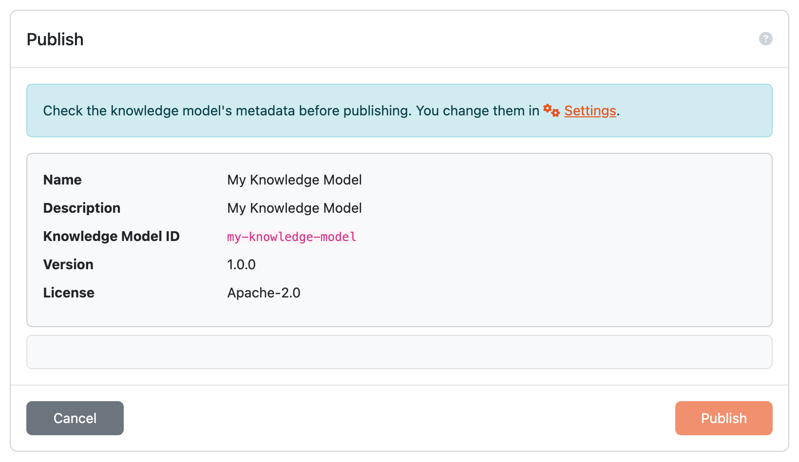

.. _knowledge-model-publish:

Publish
*******

Before the knowledge model can be used by researchers in their projects, we need to publish it. We can do that by clicking the :guilabel:`Publish` button in the top right corner of the :ref:`Knowledge Model Editor<knowledge-model-editor>`.

If we click the button, we are prompted with the metadata details to check them before publishing. We cannot change anything here, so if we want to change it, we have to click the link to :guilabel:`Settings` or press :guilabel:`Cancel` and edit the details on the :guilabel:`Settings` tab of the :ref:`Knowledge Model Editor<knowledge-model-editor>`.

If there are :ref:`locales<knowledge-model-locales>` available for the previous version or parent knowledge model, the publish dialog can offer to copy them to the new version. We should copy only locales that still match the updated knowledge model content. If the questionnaire text changed significantly, it is safer to update the locales after publishing.

    
    Publish dialog where we can confirm or cancel publishing of the knowledge model.

If we confirm the publishing of the knowledge model by clicking :guilabel:`Publish` in the modal window, the knowledge model becomes available to all users and is accessible in :ref:`Knowledge Model List<knowledge-model-list>`.

The Knowledge Model Editor will remain in the :ref:`Knowledge Model Editors<knowledge-model-editors>` list and will be available for any future changes.
