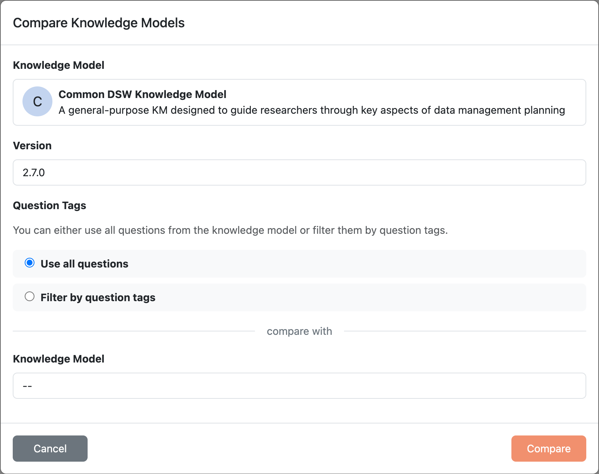

.. _km-compare:

Knowledge Model Compare
***********************

We can compare two versions of a knowledge model by clicking :guilabel:`Compare` from the right item menu (three dots) of a specific KM in the :doc:`./index` or from KM :doc:`./detail`. This will open a new page where we can select another KM to compare with. The comparison will show the differences between the two versions, including changes in the name, description, as well as changes in the structure of the KM (e.g. added or removed entities, attributes, etc.).

The comparison can be started in project migration and in KM list and detail.

When we select an item in the comparison, the side panel shows its details, including the UUID. We can use the copy button next to the UUID to copy it.

    
    Creating a KM comparison.
