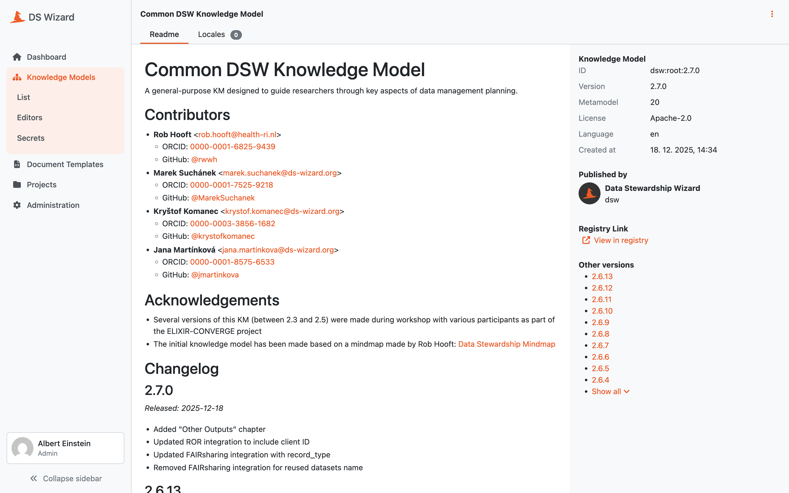

.. _km-detail:

Knowledge Model Detail
**********************

We can visit a knowledge model detail by clicking on a desired KM in the :doc:`./index` (or selecting :guilabel:`View detail` from the right item menu). The detail shows basic information about the knowledge model such as its name, ID, version, license, metamodel version, or (if applicable) what is the parent knowledge model).

The main part of the detail is the README of the KM that should contain basic information and changelog. In the right panel under the basic information, we can navigate to other versions of the KM or navigate to the `DSW Registry <https://registry.ds-wizard.org>`__ (if the KM is present there).

In the top bar, we can :guilabel:`Export` the knowledge model as a KM file or :guilabel:`Delete` this version of the knowledge model (only if it is not already used for some projects or other KMs and editors).

.. _knowledge-model-locales:

Locales
========

A knowledge model has a source language and a published version can have locales for additional languages. These locales are used in projects to show the questionnaire content in the selected language.

Locales are managed for a specific knowledge model version. From the knowledge model detail, users with permission to manage knowledge models can export a POT file, import a locale, download an existing locale, or delete a locale.

The exported POT file contains translatable strings from the knowledge model content, such as names, descriptions, answer labels, advice, and resource pages. Translators use this file to prepare a PO file for the target language. The PO file should specify the target language using the standard gettext metadata.

When a new knowledge model version is published, locales from the previous version or parent knowledge model can be copied during publishing if they are still valid. If knowledge model texts changed, the locale should be reviewed and updated for the new version.

In the top pane, we can see the options based on our permissions:

- :guilabel:`Preview` can be used to check the content of the KM via the :doc:`./preview` feature.
- :guilabel:`Export` for exporting the current version of the KM as a file.
- :guilabel:`Export .pot file` for exporting the translation template for the current version of the KM.
- :guilabel:`Compare` for comparing the current version of the KM with another version (see :doc:`./compare`).
- :guilabel:`Create KM editor` is a shortcut for :doc:`../editors/create` for creating a new version.
- :guilabel:`Fork KM` is again a shortcut for :doc:`../editors/create` to create a fork (some more specific KM based on this one).
- :guilabel:`Create project` is a shortcut to :doc:`../../projects/list/create` with this KM.
- :guilabel:`Set deprecated` or :guilabel:`Restore` for setting a KM deprecated when we no longer want users to use it for new projects.
- :guilabel:`Set public` or :guilabel:`Set private` for changing the visibility of the KM. Public KM can be viewed by non-logged in users.
- :guilabel:`Delete` the specific version of the KM (possible only if is not used in any projects or linked in other KMs and editors, cannot be undone).

If we are not seeing the latest version of the KM, a warning message is shown in the top. Similarly, we will see a notification that update is available if there is a newer version in the `DSW Registry <https://registry.ds-wizard.org>`__ (if configured).

    
    Detail of a knowledge model.
