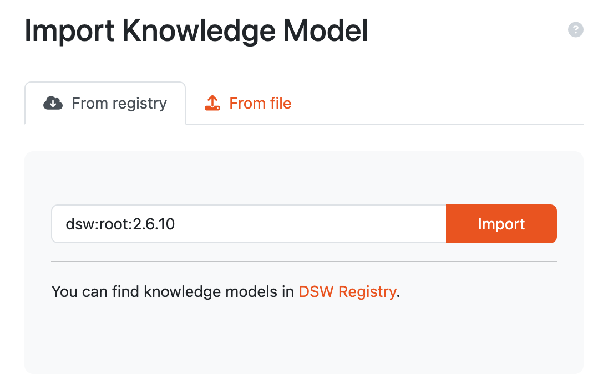
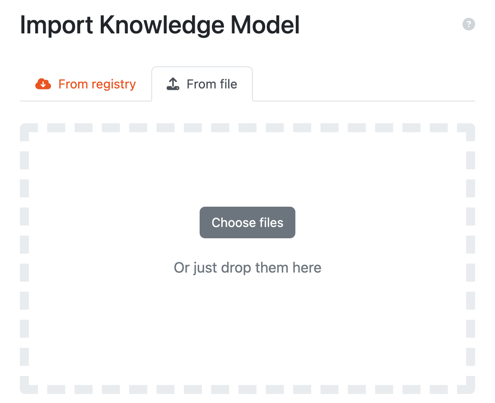

.. _km-import:

Knowledge Model Import
**********************

We can import an existing knowledge model by navigating to :doc:`./index` (:menuselection:`Knowledge Models`) in the main menu and then clicking on :guilabel:`Import` button.

.. _km-import-from-registry:

From DSW Registry
=================

We can import a knowledge model from the `DSW Registry <https://registry.ds-wizard.org>`__. This is a repository of knowledge models. To import a knowledge model from the registry, we need to enter the **knowledge model ID** of the desired template (e.g. ``dsw:lifesciences:2.6.7``) and press the :guilabel:`Import` button.

.. NOTE::

    In case of knowledge model present in the `DSW Registry <https://registry.ds-wizard.org>`__, we will be notified about the available upgrade by yellow :guilabel:`update available` badge.

    
    Input for importing a knowledge model from DSW Registry.

From file
=========

We can import a knowledge model as a KM file. Such a file can be created as an export from |project_name| (from :doc:`./index` or :doc:`./detail`). We can also select multiple files at once.

    
    Input for importing a knowledge model using a KM package.

