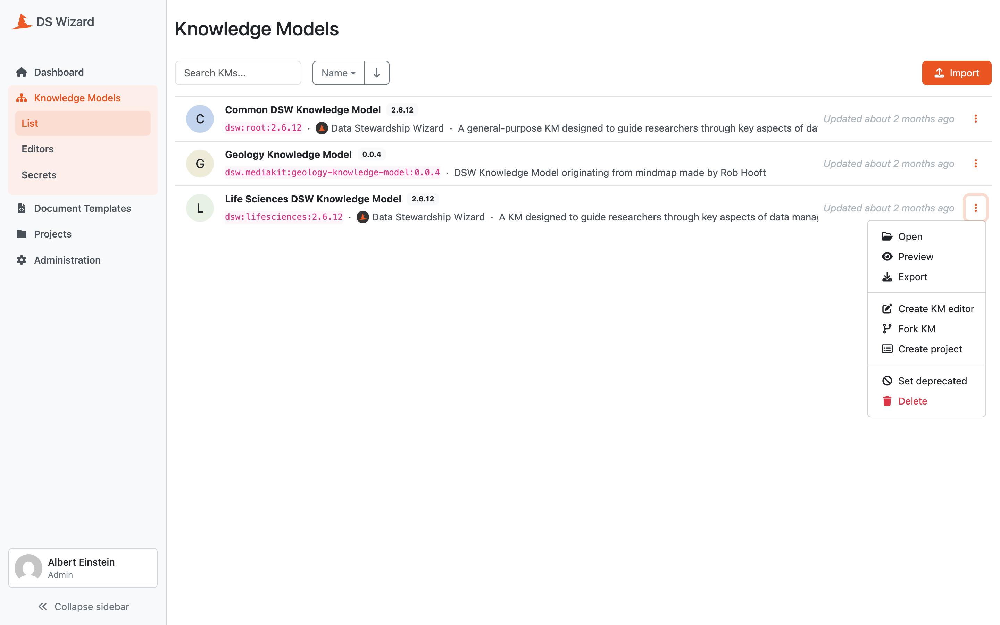

.. _knowledge-model-list:

Knowledge Model List
********************

As **data stewards** and **admins**, we can manage the knowledge models that are in our |project_name|. We can access the list of knowledge model from the main menu via :guilabel:`Knowledge Model`. The list can be filtered and sorted by name or creation date. We can also search for a specific knowledge model by its id, name or version. The list shows the name, version, id, author, description and last update.

For each knowledge model (KM), we can see the latest version in the list. If we want to read more about a specific KM or see the older versions, we need to access the :doc:`./detail` by clicking the name of KM or clicking :guilabel:`Open` from the right item menu (three dots). There are also other options for each item:

- :guilabel:`Preview` to see how :doc:`../../projects/index` generated using this KM would look like.
- :guilabel:`Export` for exporting the latest version of the KM as a file.
- :guilabel:`Create KM editor` is a shortcut for :doc:`../editors/create` for creating a new version.
- :guilabel:`Fork KM` is again a shortcut for :doc:`../editors/create` for to create a fork (some more specific KM based on this one).
- :guilabel:`Create project` is a shortcut to :doc:`../../projects/list/create` with this KM.
- :guilabel:`Set deprecated` or :guilabel:`Restore` for setting a KM deprecated when we no longer want the **researchers** to use it.
- :guilabel:`Delete` for all versions of the KM (possible only if is not used in any projects or linked in other KMs and editors).

If a newer version of the knowledge model is available in the `DSW Registry <https://registry.ds-wizard.org/>`__, a yellow :guilabel:`update available` badge, which we can use for quick update of the template to the latest version, will appear.

Finally, there is an option to :doc:`./import` by clicking the :guilabel:`Import` button in the top right part of the screen.

.. NOTE::

    You can import multiple knowledge models from file at once.

For **data stewards** and **admins**, :guilabel:`update available` badge may appear if there is a newer version of the knowledge model in the `DSW Registry <https://registry.ds-wizard.org>`__ (and if configured).

Finally, there is an option to :doc:`./import` by click the :guilabel:`Import` button in the top right part of the screen.

    
    List of all knowledge models with actions.

.. NOTE::

    Set deprecated option will apply only for the latest version of Knowledge Model. If there is an older version, that will still be available.

.. raw:: html
    
    <h2>Table of Contents</h2>

.. toctree::
    :maxdepth: 2

    Import<import>
    Detail<detail>
    Preview<preview>
    