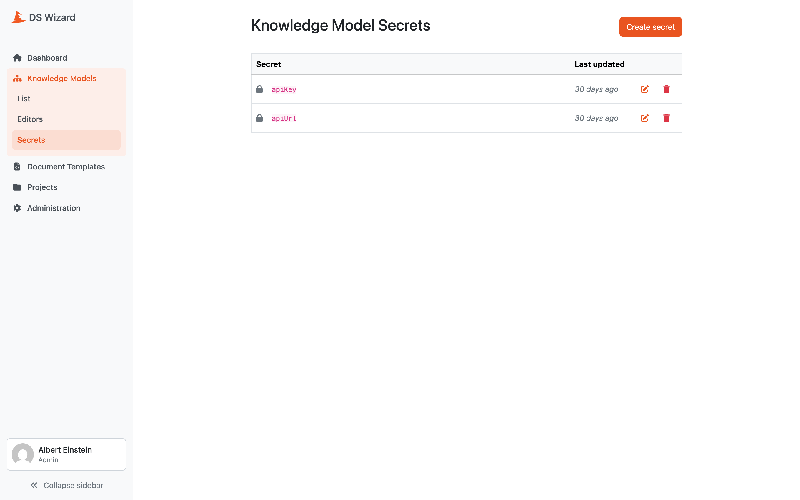

.. _knowledge-model-secrets:

Knowledge Model Secrets
***********************

Sometimes, we might need to use some secrets (for example for authentication token), additional properties (such as API URL if we want to use different one for testing and production), or basically any information that we do not want to include in the knowledge model. In that case, we can define some properties in the instance settings.

We can either click the :guilabel:`Configure secrets` or navigate there through :guilabel:`Knowledge Models → Secrets` and there is a field called **Integration Config**. It is a YAML organized by the **Integration ID** at the top level and key value pairs for each property.

We can fill some properties in. So, for example, if we want to create a secret ``apiUrl``, we need to click on :guilabel:`Create secret`, fill the name and value, and save it.

    
    List of knowledge model secrets.

Then we can go back to the knowledge model editor and in the **Advanced Integration Configuration**, we can click the copy button next to the Secret we want to use (we have the same copy button for Variables). This copies the secret name in the Jinja2 format ``{{ secrets.apiUrl }}``, which we can then use in the request configuration.
