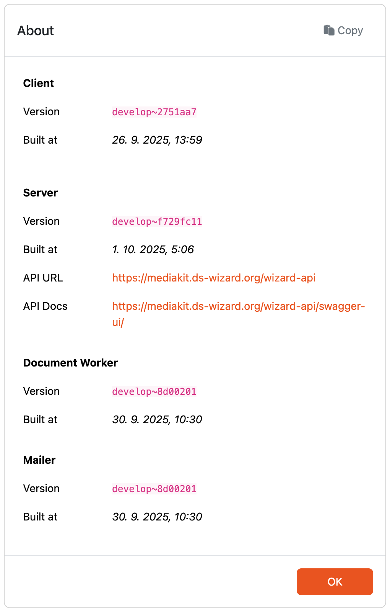

.. _about:

About
*****

By selecting the :guilabel:`About` option from the :doc:`./index` menu, users are directed to the About page. This page offers detailed information about the current versions and build timestamps of the tool's components. It also includes information about metamodels together with Project Importers and Project Actions count. This level of transparency helps ensure that both users and developers are fully informed about the specific versions and build statuses of the components they are working with.

The :guilabel:`API URL` link provides access to the server's API endpoints, which can be used for integrating the Data Stewardship Wizard with other systems and automating tasks.

The :guilabel:`API Docs` link directs to the API documentation presented in Swagger UI that provides detailed descriptions of available operations and parameters.

    
    Modal window with versions of the tool's components.
