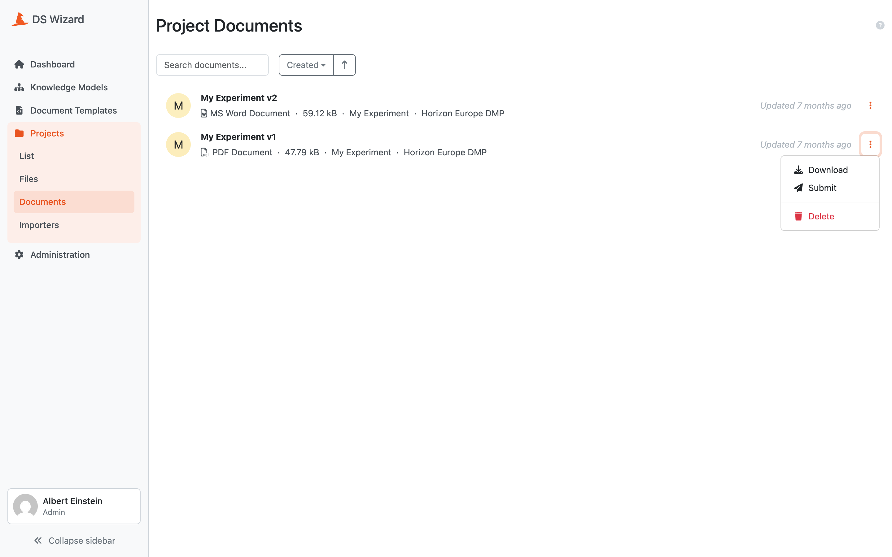

Documents
*********

As admins, we can quickly browse all documents stored in the |project_name| instance by navigating to :guilabel:`Documents` from the projects menu. It is possible to search for a document by name or sort them using their name or creation timestamp.

Each document has a name, format, specific size (if the generation is completed), a link to the project it was generated from, and a template used for its creation. The document can be directly downloaded or deleted from the list. 

In case that there is a document that was not generated due to an error, we can check the error message. Also, if there are some documents got stuck in :guilabel:`Queued` or :guilabel:`In Progress` status, we should check the deployment (especially of the document worker component).

    
    List of all documents across projects.

