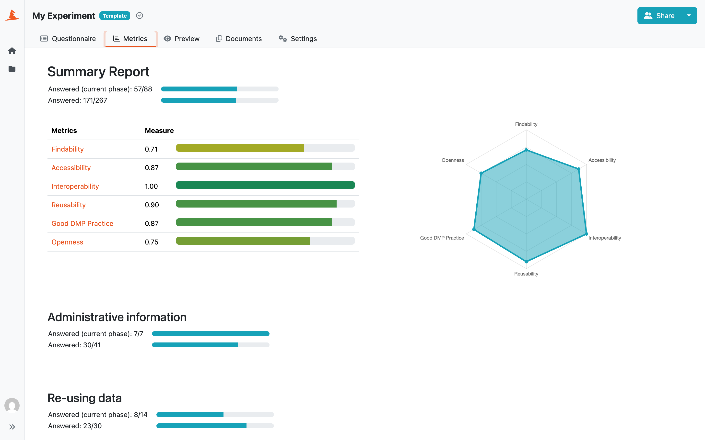

Metrics
*******

In the :guilabel:`Metrics` tab in the project detail we can see a **Summary Report** for the whole questionnaire and then the same details for each individual chapter.

    
    Summary report of project metrics.

The **Summary Report** shows how many questions are answered and unanswered in each chapter. It can either count all questions in the Knowledge Model or only the questions required for the project’s current phase. Questions from later phases are ignored in the phase-based view. If a parent question is unanswered, its child questions are not counted separately. Chapter results are combined into the total **Summary Report**.

If there are any metrics in the knowledge model, the report also shows the score for each metric. The score is calculated as a weighted average of all the answers affecting that metric and is always between 0 and 1. If there are at least 3 metrics present, a spider chart is also displayed.

There is also a metrics description at the bottom of the page to better understand what exactly each metric means.