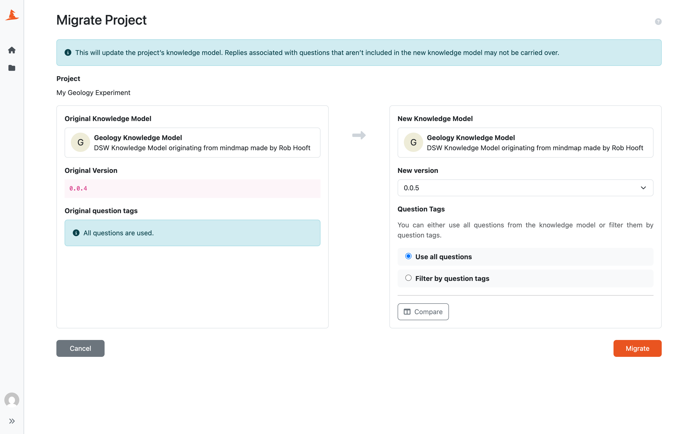

.. _project-migration:

Project Migration
*****************

Every project is based on a specific :ref:`knowledge model<knowledge-model>`, its version, and selected tags. Sometimes, we might want to change the knowledge model to a different version (for example, when a new version is released), change the knowledge model (for example, when a new customization is created), or just change the tag selection. Project migration is a process where we can do this.

Migrating a Project
===================

We can start a project migration either from the :ref:`project list<project-list>`, or from the :ref:`project settings<project-settings>`. Sometimes, when there is a newer version of the knowledge model available, we can see a :guilabel:`Outdated KM` badge next to the project name. We can click on the badge to start the migration as well.

    
    Choosing a new knowledge model for the project.

We can see the **original knowledge model**, its **version**, and selected **question tags** on the left side. On the right side we can choose new values for all of these. We can use :guilabel:`Compare` to compare the original and selected knowledge model before applying the change.

After we are satisfied with our selection, we can click the :guilabel:`Migrate` button. This updates the project to use the selected knowledge model, version, and question tags.

.. Warning::

    Replies associated with questions that are not included in the selected knowledge model may not be carried over.

If the current default document template or document format is not compatible with the selected knowledge model, it may need to be selected again in :ref:`project settings<project-settings>` after the migration.

The migration is applied directly to the project. There is no separate migration project to resume, cancel, or finalize later.
