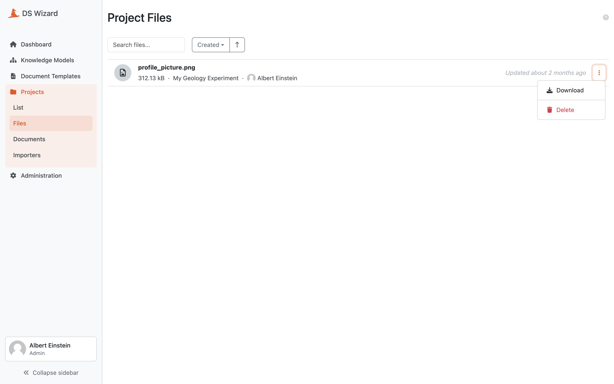

Project Files
*************

As admins, we can quickly browse all files stored in the |project_name| instance by navigating to :guilabel:`Files` from the projects menu. It is possible to search for a file by name or sort them using their creation timestamp, name or size.

Each file has a name, size, a link to the project it was uploaded to and user who uploaded it. The file can be directly downloaded or deleted from the list. 

.. WARNING::

    It is not recommended to delete files from the list without informing the project team, as it can lead to confusion among researchers. Admins should always communicate with the project team before deleting files.

    
    List of all files across projects.

