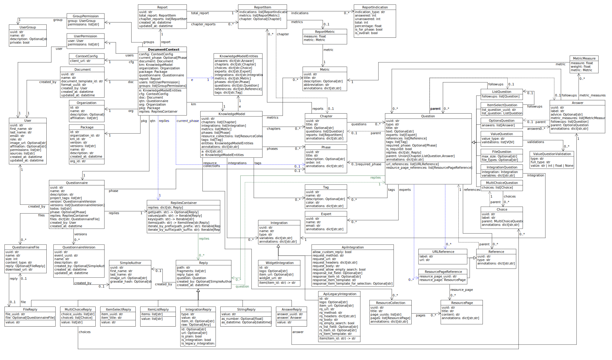

.. _document-context:

Document Context
****************

.. NOTE::

    To work efficiently with the Document Context, you want to use object instead of the JSON-like one. Please read through `DocumentContext.md <https://github.com/ds-wizard/engine-tools/blob/develop/packages/dsw-document-worker/support/DocumentContext.md>`__ directly (select different version if needed).

Document context is an object that carries all information related to a DSW questionnaire in order to produce a document. To investigate it, it is the best to use *Questionnaire Report* template with ``JSON`` format. The core fields are:

* ``config`` = object with DSW configuration related to documents, e.g., ``clientUrl`` for referring to the DSW instance
* ``document`` = object with the details about the document
   * ``createdAt`` = when the document was created (initial creation, not final generation of the document)
   * ``createdBy`` = user that created the document
   * ``documentTemplateId`` = ID of the document template used of the document
   * ``formatUuid`` = UUID of the format in the document template
   * ``name`` = name of the document (entered when creating, not file name)
   * ``uuid``
* ``extras`` = additional data added by document worker if requested
* ``groups`` = groups with access to the project
* ``knowledgeModel`` = object describing used KM for the questionnaire
   * ``annotations`` = list of key-value annotations of KM top-level entity
   * ``chapterUuids`` = list of UUIDs for chapters (ordered)
   * ``integrationUuids`` = list of UUIDs for integrations (ordered)
   * ``metricUuids`` = list of UUIDs for metrics (ordered)
   * ``phaseUuids`` = list of UUIDs for phases (ordered)
   * ``resourceCollectionUuids`` = list of UUIDs for resource collections (ordered)
   * ``tagUuids`` = list of UUIDs for tags (ordered)
   * ``entities`` = contains ``questions``, ``answers``, and other maps with UUID-entity pairs
   * ``uuid`` = UUID of the knowledge model
* ``metamodelVersion`` = metamodel version of the document context (document template metamodel version)
* ``organization`` = object describing organization that runs the DSW instance
   * ``affiliations`` = list of suggested affiliation within the organization
   * ``description``
   * ``name``
   * ``organizationId``
* ``package`` = object with metadata about the KM package such as ``version``, ``name``, or ``description``
* ``questionnaire`` = object representing the questionnaire
   * ``createdAt`` = when the questionnaire/project was created
   * ``createdBy`` = original author who created the questionnaire/project
   * ``description`` = optional description of the questionnaire/project
   * ``labels`` = path-list map of labels on questions (i.e. TODOs)
   * ``name`` = name of the questionnaire/project
   * ``phaseUuid`` = UUID of the current phase selected
   * ``replies`` = path-object map of replies to questions
   * ``updatedAt`` = when the questionnaire/project was last updated
   * ``uuid`` = UUID of the questionnaire/project
   * ``versionUuid`` = optional UUID of the current version of the questionnaire
   * ``versions`` = ordered list of questionnaire versions (objects with details)
* ``report`` = object that contains report for the questionnaire that contains computed information about number of answered questions as well as metric values
* ``users`` = users with access to the project (each entry contains ``perms`` list and ``user`` object)

This structure is provided to a Jinja template in :doc:`steps/jinja` and outputted from :doc:`steps/json`. We can use the JSON step to observe the actual content of the document context (structure as well as the values). Finally, we can also check :doc:`../metamodel-schemas` (the relevant JSON schema for document context).

.. _document-context-obj:

Objectified Document Context
============================

It is possible to easily turn the JSON-like / tree-structured document context into objects with additional helper relations, attributes, methods, and many more to ease up the template development:

.. code:: jinja

   

-  All data types are using Python, e.g., ``str`` is textual string, ``Optional[str]`` is a string or ``None``, ``list[str]`` is a list of strings.
-  We use ``snake_case`` for naming of attributes and variables, ``PascalCase`` is used for class names.
-  ``datetime`` is the standard `datetime <https://docs.python.org/3/library/datetime.html#datetime-objects>`__ module.

Diagram
-------

We provide the structure visualized on a class diagram (right-click and open in to tab to enlarge):

|document-context-diagram|

Entities
--------

Here is an interlinked description of each entity and its attributes and links. There are also *aliases* that are convenient shorthands to make template more concise.

.. _odc-document-context:

DocumentContext
~~~~~~~~~~~~~~~

-  ``config`` (:ref:`odc-context-config`)
-  ``current_phase`` (``Optional[``\ :ref:`odc-phase`\ ``]``)
-  ``document`` (:ref:`odc-document`)
-  ``groups`` (``list[``\ :ref:`odc-group-perm`\ ``]``)
-  ``km`` (:ref:`odc-knowledge-model`)
-  ``metamodel_version`` (``int``)
-  ``organization`` (:ref:`odc-organization`)
-  ``package`` (:ref:`odc-package`)
-  ``questionnaire`` (:ref:`odc-questionnaire`)
-  ``report`` (:ref:`odc-report`)
-  ``users`` (``list[``\ :ref:`odc-user-perm`\ ``]``)

Aliases:

-  ``e`` (:ref:`odc-knowledge-model-entities`) - same as ``km.entities``
-  ``doc`` (:ref:`odc-document`) - same as ``document``
-  ``org`` (:ref:`odc-organization`) - same as ``organization``
-  ``pkg`` (:ref:`odc-package`) - same as ``package``
-  ``qtn`` (:ref:`odc-questionnaire`) - same as ``questionnaire``
-  ``replies`` (:ref:`odc-replies-container`) - same as ``questionnaire.replies``

.. _odc-context-config:

ContextConfig
~~~~~~~~~~~~~

-  ``client_url`` (``str``) - base URL of the DSW instance (client app)

.. _odc-document:

Document
~~~~~~~~

-  ``uuid`` (``str``)
-  ``name`` (``str``)
-  ``document_template_id`` (``str``)
-  ``format_uuid`` (``str``)
-  ``created_by`` (:ref:`odc-user`)
-  ``created_at`` (``datetime``)
-  ``updated_at`` (``datetime``)

.. _odc-organization:

Organization
~~~~~~~~~~~~

-  ``id`` (``str``)
-  ``name`` (``str``)
-  ``description`` (``Optional[str]``)
-  ``affiliations`` (``list[str]``)

.. _odc-package:

Package
~~~~~~~

-  ``id`` (``str``) - full ID of KM Package
-  ``organization_id`` (``str``)
-  ``km_id`` (``str``)
-  ``version`` (``str``)
-  ``versions`` (``list[str]``)
-  ``name`` (``str``)
-  ``description`` (``Optional[str]``)
-  ``created_at`` (``datetime``)

.. _odc-questionnaire:

Questionnaire
~~~~~~~~~~~~~

-  ``uuid`` (``str``)
-  ``name`` (``str``)
-  ``description`` (``Optional[str]``)
-  ``version`` (``Optional[``\ :ref:`odc-questionnaire-version`\ ``]``)
-  ``versions`` (``list[``\ :ref:`odc-questionnaire-version`\ ``]``)
-  ``phase`` (``Optional[``\ :ref:`odc-phase`\ ``]``)
-  ``project_tags`` (``list[str]``)
-  ``replies`` (:ref:`odc-replies-container`)
-  ``todos`` (``list[str]``)
-  ``created_by`` (:ref:`odc-user`)
-  ``created_at`` (``datetime``)
-  ``updated_at`` (``datetime``)

.. _odc-questionnaire-file:

QuestionnaireFile
~~~~~~~~~~~~~~~~~~~~

-  ``uuid`` (``str``)
-  ``name`` (``str``)
-  ``size`` (``int``)
-  ``content_type`` (``str``)
-  ``reply`` (``Optional[``\ :ref:`odc-file-reply`\ ``]``)
-  ``download_url`` (``str``)

.. _odc-questionnaire-version:

QuestionnaireVersion
~~~~~~~~~~~~~~~~~~~~

-  ``uuid`` (``str``)
-  ``event_uuid`` (``str``)
-  ``name`` (``str``)
-  ``description`` (``Optional[str]``)
-  ``created_by`` (:ref:`odc-simple-author`)
-  ``created_at`` (``datetime``)
-  ``updated_at`` (``datetime``)

.. _odc-user:

User
~~~~

-  ``uuid`` (``str``)
-  ``first_name`` (``str``)
-  ``last_name`` (``str``)
-  ``email`` (``str``)
-  ``role`` (``str``) - one of: ``admin``, ``dataSteward``, ``researcher``
-  ``image_url`` (``Optional[str]``)
-  ``affiliation`` (``Optional[str]``)
-  ``permissions`` (``list[str]``)
-  ``sources`` (``list[str]``)
-  ``created_at`` (``datetime``)
-  ``updated_at`` (``datetime``)

.. _odc-user-group:

UserGroup
~~~~~~~~~

-  ``uuid`` (``str``)
-  ``name`` (``str``)
-  ``description`` (``str``)
-  ``private`` (``bool``)
-  ``members`` (``list[``\ :ref:`odc-user-membership`\ ``]``)
-  ``created_at`` (``datetime``)
-  ``updated_at`` (``datetime``)

.. _odc-user-membership:

UserMembership
~~~~~~~~~~~~~~

-  ``uuid`` (``str``)
-  ``first_name`` (``str``)
-  ``last_name`` (``str``)
-  ``gravatar_hash`` (``str``)
-  ``image_url`` (``Optional[str]``)
-  ``membership_type`` (``str``) - one of: ``member``, ``owner``

.. _odc-simple-author:

SimpleAuthor
~~~~~~~~~~~~

-  ``uuid`` (``str``)
-  ``first_name`` (``str``)
-  ``last_name`` (``str``)
-  ``image_url`` (``Optional[str]``)
-  ``gravatar_hash`` (``Optional[str]``)

.. _odc-user-perm:

UserPermission
~~~~~~~~~~~~~~

- ``user`` (:ref:`odc-user`)
- ``permissions`` (``list[str]``) - contains: ``VIEW``, ``COMMENT``, ``EDIT``, ``ADMIN``

Helpers:

- is_viewer (``bool``)
- is_commenter (``bool``)
- is_editor (``bool``)
- is_owner (``bool``)

.. _odc-group-perm:

GroupPermission
~~~~~~~~~~~~~~~

- ``group`` (:ref:`odc-user-group`)
- ``permissions`` (``list[str]``) - contains: ``VIEW``, ``COMMENT``, ``EDIT``, ``ADMIN``

Helpers:

- is_viewer (``bool``)
- is_commenter (``bool``)
- is_editor (``bool``)
- is_owner (``bool``)

.. _odc-report:

Report
~~~~~~

-  ``uuid`` (``str``)
-  ``total_report`` (:ref:`odc-report-item`)
-  ``chapter_reports`` (``list[``\ :ref:`odc-report-item`\ ``]``)
-  ``created_at`` (``datetime``)
-  ``updated_at`` (``datetime``)

.. _odc-report-item:

ReportItem
^^^^^^^^^^

-  ``indications`` (``list[``\ :ref:`odc-report-indication`\ ``]``)
-  ``metrics`` (``list[``\ :ref:`odc-report-metric`\ ``]``)
-  ``chapter`` (``Optional[``\ :ref:`odc-chapter`\ ``]``) - set if it is a chapter report

.. _odc-report-indication:

ReportIndication
^^^^^^^^^^^^^^^^

-  ``indication_type`` (``str``) - one of: ``PhasesAnsweredIndication``, ``AnsweredIndication`` (use alias)
-  ``answered`` (``int``) - number of answered questions
-  ``unanswered`` (``int``) - number of unanswered questions

Aliases:

-  ``total`` (``int``) - ``answered`` + ``unanswered``
-  ``percentage`` (``float``) - ``answered`` / ``total`` (handles zero division, number between ``0.0`` and ``1.0``)
-  ``is_for_phase`` (``bool``) - if it is a phase-related indication
-  ``is_overall`` (``bool``) - if it is an overall indication (not phase-related)

.. _odc-report-metric:

ReportMetric
^^^^^^^^^^^^

-  ``measure`` (``float``) - number between ``0.0`` and ``1.0``
-  ``metric`` (:ref:`odc-metric`)

.. _odc-knowledge-model:

KnowledgeModel
~~~~~~~~~~~~~~

-  ``uuid`` (``str``)
-  ``annotations`` (``dict[str,str]``)
-  ``entities`` (:ref:`odc-knowledge-model-entities`)
-  ``chapters`` (``list[``\ :ref:`odc-chapter`\ ``]``)
-  ``integrations`` (``list[``\ :ref:`odc-integration`\ ``]``)
-  ``metrics`` (``list[``\ :ref:`odc-metric`\ ``]``)
-  ``phases`` (``list[``\ :ref:`odc-phase`\ ``]``)
-  ``resource_collections`` (``list[``\ :ref:`odc-resource-collection`\ ``]``)
-  ``tags`` (``list[``\ :ref:`odc-tag`\ ``]``)

Aliases:

-  ``e`` (:ref:`odc-knowledge-model-entities`) - same as ``entities``
-  ``a`` (``dict[str,str]``) - same as ``annotations``

Notes: 

-  Equality of all KM entities is being done using the ``uuid`` comparison under the hood.
-  All KM entities that have ``annotations`` have also the ``a`` alias.

.. _odc-knowledge-model-entities:

KnowledgeModelEntities
^^^^^^^^^^^^^^^^^^^^^^

Container holding all types of Knowledge Model entities within UUID-key
dictionaries:

-  ``answers`` (``dict[str,``\ :ref:`odc-answer`\ ``]``)
-  ``chapter`` (``dict[str,``\ :ref:`odc-chapter`\ ``]``)
-  ``choices`` (``dict[str,``\ :ref:`odc-choice`\ ``]``)
-  ``experts`` (``dict[str,``\ :ref:`odc-expert`\ ``]``)
-  ``integrations`` (``dict[str,``\ :ref:`odc-integration`\ ``]``)
-  ``metrics`` (``dict[str,``\ :ref:`odc-metric`\ ``]``)
-  ``phases`` (``dict[str,``\ :ref:`odc-phase`\ ``]``)
-  ``questions`` (``dict[str,``\ :ref:`odc-question`\ ``]``)
-  ``references`` (``dict[str,``\ :ref:`odc-reference`\ ``]``)
-  ``resource_collections (``dict[str,``\ :ref:`odc-resource-collection`\ ``]``)
-  ``tags`` (``dict[str,``\ :ref:`odc-tag`\ ``]``)

.. _odc-chapter:

Chapter
^^^^^^^

-  ``uuid`` (``str``)
-  ``title`` (``str``)
-  ``text`` (``Optional[str]``) - possibly Markdown text
-  ``questions`` (``list[``\ :ref:`odc-question`\ ``]``)
-  ``reports`` (``list[``\ :ref:`odc-report-item`\ ``]``)
-  ``annotations`` (``dict[str,str]``)

.. _odc-question:

Question
^^^^^^^^

Superclass with common attributes for all types of questions. You always
get a more specific one and never just a ``Question``.

-  ``uuid`` (``str``)
-  ``type`` (``str``)
-  ``title`` (``str``)
-  ``text`` (``Optional[str]``)
-  ``required_phase`` (``Optional[``\ :ref:`odc-phase`\ ``]``)
-  ``is_required`` (``bool``) - if the question is required in the current phase
-  ``replies`` (``dict[str,``\ :ref:`odc-reply`\ ``]``) - path-key dictionary of replies to the question
-  ``experts`` (``list[``\ :ref:`odc-expert`\ ``]``)
-  ``references`` (``list[``\ :ref:`odc-reference`\ ``]``)
-  ``tags`` (``list[``\ :ref:`odc-tag`\ ``]``)
-  ``parent`` (``Union[``\ :ref:`odc-chapter`\ ``,``\ :ref:`odc-list-question`\ ``,``\ :ref:`odc-answer`\ ``]``)
-  ``annotations`` (``dict[str,str]``)

Aliases:

-  ``url_references`` (``list[``\ :ref:`odc-url-reference`\ ``]``)
-  ``resource_page_references`` (``list[``\ :ref:`odc-resource-page-reference`\ ``]``)

Notes:

- Parent of a question can be of multiple kinds, you may use the ``of_type`` test to check what it is if needed.

.. _odc-value-question:

ValueQuestion
'''''''''''''

-  ``value_type`` (``str``) - type of value, use alias

Aliases:

-  ``is_string`` (``bool``)
-  ``is_text`` (``bool``)
-  ``is_number`` (``bool``)
-  ``is_date`` (``bool``)

.. _odc-integration-question:

IntegrationQuestion
'''''''''''''''''''

-  ``integration`` (:ref:`odc-integration`)
-  ``props`` (``dict[str,str]``)

.. _odc-options-question:

OptionsQuestion
'''''''''''''''

-  ``answers`` (``list[``\ :ref:`odc-answer`\ ``]``)

.. _odc-multichoice-question:

MultiChoiceQuestion
'''''''''''''''''''

-  ``choices`` (``list[``\ :ref:`odc-choice`\ ``]``)

.. _odc-list-question:

ListQuestion
''''''''''''

-  ``followups`` (``list[``\ :ref:`odc-question`\ ``]``)

.. _odc-item-select-question:

ItemSelectQuestion
''''''''''''''''''

-  ``list_question`` (``Optional[``\ :ref:`odc-list-question`\ ``]``)

.. _odc-file-question:

FileQuestion
''''''''''''

-  ``max_size`` (``Optional[int]``) - maximum file size (in bytes) allowed
-  ``file_types`` (``Optional[str]``) - comma-separated file type specifications 

.. _odc-answer:

Answer
^^^^^^

-  ``uuid`` (``str``)
-  ``label`` (``str``)
-  ``advice`` (``Optional[str]``) - possibly Markdown text
-  ``metric_measures`` (``list[``\ :ref:`odc-metric-measure`\ ``]``)
-  ``followups`` (``list[``\ :ref:`odc-question`\ ``]``)
-  ``parent`` (:ref:`odc-options-question`)
-  ``annotations`` (``dict[str,str]``)

.. _odc-metric-measure:

MetricMeasure
'''''''''''''

Indication of how an answer affects a certain metric.

-  ``measure`` (``float``) - value between ``0.0`` and ``1.0`` (inclusive)
-  ``weight`` (``float``) - value between ``0.0`` and ``1.0`` (inclusive)
-  ``metric`` (:ref:`odc-metric`)

.. _odc-choice:

Choice
^^^^^^

-  ``uuid`` (``str``)
-  ``label`` (``str``)
-  ``parent`` (:ref:`odc-multichoice-question`)
-  ``annotations`` (``dict[str,str]``)

.. _odc-expert:

Expert
^^^^^^

-  ``uuid`` (``str``)
-  ``name`` (``str``)
-  ``email`` (``str``)
-  ``annotations`` (``dict[str,str]``)

.. _odc-reference:

Reference
^^^^^^^^^

As for the :ref:`odc-question` class, ``Reference`` is also a superclass and you will always get an object of its subclass.

-  ``uuid`` (``str``)
-  ``type`` (``str``)
-  ``annotations`` (``dict[str,str]``)

.. _odc-url-reference:

URLReference
''''''''''''

-  ``label`` (``str``)
-  ``url`` (``str``)

.. _odc-resource-page-reference:

ResourcePageReference
'''''''''''''''''''''

-  ``resource_page`` (``Optional[``\ :ref:`odc-resource-page`\ ``]``)

.. _odc-resource-collection:

ResourceCollection
^^^^^^^^^^^^^^^^^^

-  ``uuid`` (``str``)
-  ``title`` (``str``)
-  ``pages`` (``list[``\ :ref:`odc-resource-page`\ ``]``)
-  ``annotations`` (``dict[str,str]``)

.. _odc-resource-page:

ResourcePage
^^^^^^^^^^^^

-  ``uuid`` (``str``)
-  ``title`` (``str``)
-  ``content`` (``str``)
-  ``collection`` (:ref:`odc-resource-collection`)
-  ``annotations`` (``dict[str,str]``)

.. _odc-metric:

Metric
^^^^^^

-  ``uuid`` (``str``)
-  ``title`` (``str``)
-  ``abbreviation`` (``str``)
-  ``description`` (``Optional[str]``) - possibly Markdown text
-  ``annotations`` (``dict[str,str]``)

.. _odc-phase:

Phase
^^^^^

-  ``uuid`` (``str``)
-  ``title`` (``str``)
-  ``description`` (``Optional[str]``) - possibly Markdown text
-  ``order`` (``int``) - order of the phase within the KM
-  ``annotations`` (``dict[str,str]``)

.. _odc-integration:

Integration
^^^^^^^^^^^

-  ``uuid`` (``str``)
-  ``id`` (``str``)
-  ``name`` (``str``)
-  ``item_url`` (``Optional[str]``)
-  ``logo`` (``Optional[str]``)
-  ``props`` (``dict[str,str]``)
-  ``rq_method`` (``str``)
-  ``rq_url`` (``str``)
-  ``rq_headers`` (``dict[str,str]``)
-  ``rq_body`` (``str``)
-  ``rs_list_field`` (``Optional[str]``)
-  ``rs_item_id`` (``Optional[str]``)
-  ``rs_item_template`` (``str``)
-  ``annotations`` (``dict[str,str]``)

Operations:

-  ``item(item_id: str) -> Optional[str]`` - URL of an item identified by string ID

.. _odc-tag:

Tag
^^^

-  ``uuid`` (``str``)
-  ``name`` (``str``)
-  ``description`` (``Optional[str]``) - possibly Markdown text
-  ``color`` (``str``)
-  ``annotations`` (``dict[str,str]``)

.. _odc-replies-container:

RepliesContainer
~~~~~~~~~~~~~~~~

Wrapper around a path-key dictionary of replies.

-  ``replies`` (``dict[str,``\ :ref:`odc-reply`\ ``]``)

Operations:

-  ``X[path: str]`` (``Optional[``\ :ref:`odc-reply`\ ``]``) - you can get a reply using square brackets
-  ``len(X)`` (``int``) - number of replies in the container
-  ``get(path: str) -> Optional[``\ :ref:`odc-reply`\ ``]``
-  ``iterate_by_prefix(path_prefix: str) -> Iterable[``\ :ref:`odc-reply`\ ``]``
   - *O(n)* iteration with filter
-  ``iterate_by_suffix(path_suffix: str) -> Iterable[``\ :ref:`odc-reply`\ ``]``
   - *O(n)* iteration with filter
-  ``values() -> Iterable[``\ :ref:`odc-reply`\ ``]``
-  ``keys() -> Iterable[str]``
-  ``items() -> ItemsView[str,``\ :ref:`odc-reply`\ ``]``

.. _odc-reply:

Reply
~~~~~

Superclass with common attributes for all types of replies. You always
get a more specific one and never just a ``Reply``.

-  ``path`` (``str``)
-  ``fragments`` (``list[str]``) - UUIDs of the path (starting with chapter)
-  ``type`` (``str``)
-  ``created_at`` (``datetime``)
-  ``created_by`` (:ref:`odc-simple-author`)
-  ``question`` (:ref:`odc-question`) - you can assume more specific type of ``Question`` based on a type of ``Reply``

AnswerReply
^^^^^^^^^^^

-  ``answer`` (:ref:`odc-answer`) - selected answer as the option

Aliases:

-  ``value`` (``str``) - UUID of the answer (``answer.uuid``)

Notes:

-  ``question`` is always :ref:`odc-options-question`

MultiChoiceReply
^^^^^^^^^^^^^^^^

-  ``choices`` (``list[``\ :ref:`odc-choice`\ ``]``) - selected answer as the option

Aliases:

-  ``value`` (``list[str]``) - list of UUIDs of the choices

Notes:

-  ``question`` is always :ref:`odc-options-question`
-  You can iterate directly over reply object(``for choice in reply``)

StringReply
^^^^^^^^^^^

-  ``value`` (``str``)

Aliases:

-  ``as_number`` (``Optional[float]``) - tries to cast the value to a
   number
-  ``as_datetime`` (``Optional[datetime]``) - tries to cast the value to
   a timestamp

Notes:

-  ``question`` is always :ref:`odc-value-question`

.. _odc-file-reply:

FileReply
^^^^^^^^^^^

-  ``file_uuid`` (``str``)
-  ``file`` (``Optional[``\ :ref:`odc-questionnaire-file`\ ``]``) - ``None`` if file has been deleted

Aliases:

-  ``value`` (``str``) - same as ``file_uuid``

Notes:

-  ``question`` is always :ref:`odc-file-question`

ItemListReply
^^^^^^^^^^^^^

-  ``items`` (``list[str]``) - list of items UUIDs (used in reply paths)

Aliases:

-  ``value`` (``list[str]``) - same as ``items``

Notes:

-  ``question`` is always :ref:`odc-list-question`
-  You can iterate directly over reply object (``for item in reply``)

ItemSelectReply
^^^^^^^^^^^^^^^

-  ``item_uuid`` (``str``)
-  ``item_title`` (``str``)

Aliases:

-  ``value`` (``str``) - same as ``item_uuid``

Notes:

-  ``question`` is always :ref:`odc-item-select-question`

IntegrationReply
^^^^^^^^^^^^^^^^

-  ``value`` (``str``)
-  ``item_id`` (``Optional[str]``) - ID of item if selected using :ref:`odc-integration`

Aliases:

-  ``id`` (``Optional[str]``) - same as ``item_id``
-  ``is_plain`` (``bool``) - entered by user ignoring the integration
-  ``is_integration`` (``bool``) - selected by user using the integration
-  ``url`` (``Optional[str]``) - item URL based :ref:`odc-integration` if selected from it

