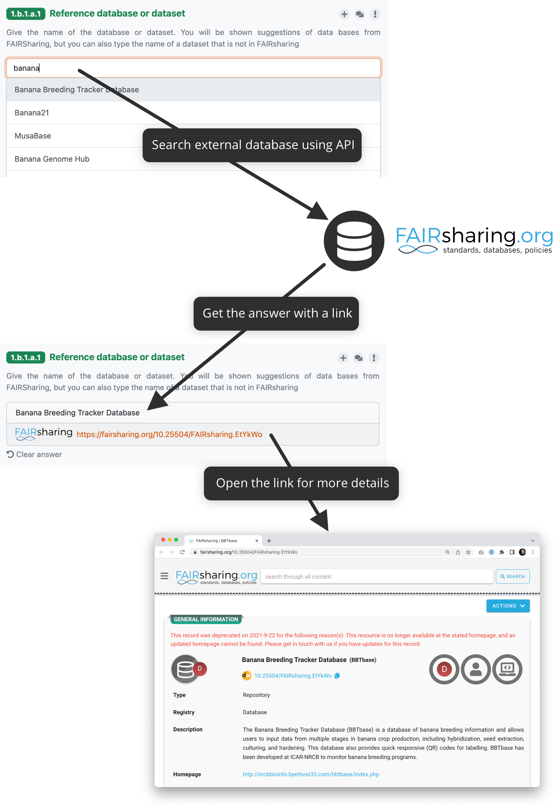

Integration Question - API
**************************

:ref:`Integration question<integration-question>` can be connected to an external resource using its API. We can then search for the results from the external service using the |project_name| questionnaire interface. When we select an answer it is not only the text (such as a name of the database), but also a link to the external service to the selected item. The whole flow is denoted in the following diagram.

We can use `Jinja2 templating language <https://jinja.palletsprojects.com/en/stable/>`_ to construct everything in integrations.

    
    How integration question connected to, for example, FAIRsharing API works.

External Service Requirements
=============================

If we want to connect an external service using the API there are certain requirements for it to make the connection to |project_name| possible.

- **Allows search using free text**
  
  - There must be a way to send a search phrase to the API so that it can filter the results based on it

- **Returns a JSON response with a list of results**

  - The response must be JSON so |project_name| can parse it
  - There needs to be a JSON list where all the items matching the search query are

Configuration
=============

The configuration is done in the :ref:`knowledge model editor<knowledge-model-editor>`. First of all, we need to create a new integration and choose its **Type** to be **API**. Then we need to fill the integration **Name**.
  
Advanced Integration Configuration
----------------------------------

Additional integration configuration can be used when we want to force the integration reply, or when adding and editing **Variables** and **Secrets**.

- **Allow Custom Reply** - The custom reply is turned on by default. We can turn it off if we want to force the integration reply. In that case, users will have to select one of the results from the external service, otherwise their reply will not be saved. This can be mentioned in the question description for the researchers.
- **Variables** - We can use variables to parametrize the integration for each question. To define the variables, whose value can be filled on the questions using this integration. The variables can then be used in the request configuration. For example, if you define a variable named type, you can use it as ``{{ variables.type }}``, such as ``ht​tps://example.com/{{ type }}``.
- **Secrets** - Secrets can be used to store sensitive information, such as API keys or access tokens. We can reference these secrets as ``{{ secrets.secret_name }}`` anywhere in the request configuration, but their values will not be exposed in the question or answer templates. The additional knowledge model secrets documentation can be found :ref:`here<knowledge-model-secrets>`.

Request Configuration
---------------------

Clicking on field before the URL we can switch between ``GET`` and ``POST`` request methods.

In the full API endpoint used for search we can use ``{{ q }}`` to insert the user's search term, and ``{{ variables.name }}`` for referencing variables and ``{{ secrets.name }}`` for secrets.

So for example, we can write **Request URL** as:

.. code-block::

    {{ secrets.apiUrl }}/search/?q={{ q }}&registry={{ variables.registry }}

We can also import the request configuration from a cURL command using the **Import** button.

Advanced Request Configuration
------------------------------

The advanced request configuration defines how the API request is constructed. This includes the request HTTP headers, request HTTP body and allow empty search switch.

- **Request HTTP Headers** - some headers might be needed, such as ``Accept: application/json`` to have a correct response type
- **Request HTTP Body** - if we need to send some HTTP body
- **Allow Empty Search** - some APIs don't work if we try to search with an empty string, turn this of in such case

We can use ``{{ q }}`` for the search term, ``{{ variables.name }}`` for referencing variables and ``{{ secrets.name }}`` for secrets within those fields.

Test
----

In this section we can test the API integration. After filling in **Request Configuration**, **Test Search Query**, and optionally **Test Variables** we can use the **Load** button to send a test request to the API and see the response.

Then we can view the **Request Details** and **Response**. In case of error we can check the logs for more information. In case of success, we can see the response JSON and use it to fill the **Response Configuration**.

Response Configuration
----------------------

In the **Response** section, we configure how to process the JSON response from the external service. For that, we need to configure the following:

- **Response List Field** - where in the JSON response is the list of items corresponding to the search query
- **Response Item Template** - how we want to present the result to the user

.. NOTE::

    We can also set the **Response Item Template** and/or **Response Item Template for Selection** to setup logo for the integration if we can access it.

The integration will show suggestions for **Response List Field** and **Response Item Template** based on the response structure. We can click the suggestions to insert them in the fields in the Jinja2 notation.

Advance Response Configuration
------------------------------

The Advance response configuration allows to set **Response Item Template for Selection** which can be used to define how the selection of items from the integration will be presented before selection.

Integration Question - API (Legacy)
***********************************

.. WARNING::

    This section covers legacy integration type. This integration type is deprecated and will be removed in the future. Please use the new **API integration** type instead.

:ref:`Integration question<integration-question>` can be connected to an external resource using its API. We can then search for the results from the external service using the |project_name| questionnaire interface. When we select an answer it is not only the text (such as a name of the database), but also a link to the external service to the selected item. The whole flow is denoted in the following diagram.

    
    How integration question connected to, for example, FAIRsharing API works.

External Service Requirements (Legacy)
======================================

If we want to connect an external service using the API there are certain requirements for it to make the connection to |project_name| possible.

- **Allows search using free text**
  
  - There must be a way to send a search phrase to the API so that it can filter the results based on it

- **Returns a JSON response with a list of results**

  - The response must be JSON so |project_name| can parse it
  - There needs to be a JSON list where all the items matching the search query are
  
- **It is possible to construct a link to the selected item**

  - We also need to be able to construct the link to the item from the data we get in the response so we can provide it with the answer

Configuration (Legacy)
======================

The configuration is done in the :ref:`knowledge model editor<knowledge-model-editor>`. First of all, we need to create a new integration and choose its **Type** to be **API**. Then, there are some metadata, such as **ID**, **Name**, or **Logo URL**.

Request Configuration (Legacy)
------------------------------

In the **Request** section, we configure how to make an HTTP requests to the external service's API. For that, we need to configure the following (the specific values depends on how the API works):

- **Request URL** - what is the URL where we want to send search requests
- **Request HTTP Method** - what HTTP method should be used
- **Request HTTP Headers** - some headers might be needed, such as ``Accept: application/json`` to have a correct response type
- **Request HTTP Body** - if we need to send some HTTP body
- **Allow Empty Search** - some APIs don't work if we try to search with an empty string, turn this of in such case

There is a special property ``${q}`` that we can use within those fields. The property represents the string that users type to the questionnaire. When configuring ``Request HTTP Headers`` and ``Request HTTP Body``, we can also use other variables such as ``props`` to pass the search query to the API.

So for example, we can write **Request URL** as:

.. code-block::

    http://example.com/api/search?q=${q}

Response Configuration (Legacy)
-------------------------------

In the **Response** section, we configure how to process the JSON response from the external service. For that, we need to configure the following:

- **Response List Field** - where in the JSON response is the list of items corresponding to the search query
- **Response Item ID** - what field represents an item ID in the returned JSON
- **Response Item Template** - how we want to present the result to the user

We can use Jinja2 templates (`Ginger <https://ginger.tobiasdammers.nl>`_ implementation) in Response Item ID and especially in Response Item Template to make the response item look better.

Secrets and Other Properties (Legacy)
-------------------------------------

Sometimes, we might need to use some secrets (for example for authentication token), additional properties (such as API URL if we want to use different one for testing and production), or basically any information that we do not want to include in the knowledge model. In that case, we can define some properties in the instance settings.

We need to navigate to :guilabel:`Administration → Settings → Knowledge Models` and there is a field called **Integration Config**. It is a YAML organized by the **Integration ID** at the top level and key value pairs for each property.

We can fill some properties in. So, for example, if the **Integration ID** of our integration is *ourIntegration* we can write:

.. code-block:: yaml

    ourIntegration:
        authorizationToken: "abcd"
        apiUrl: "http://example.com/api"

Then, in the configuration of our integration, we can use these properties in the request configuration, so for example the **Request URL** can be:

.. code-block::

    ${apiUrl}/search?q=${q}

And we can add a header such as:

.. code-block::

    Authorization: Bearer ${authorizationToken}

.. NOTE::

    These properties can be accessed only from the integration with matching ID.

Video Tutorial (Legacy)
=======================

We have the following video tutorial showing how to set up the integration question using API.

.. youtube:: x-kx6ppVBo0
    :width: 100%
    :align: center

External Resources (Legacy)
===========================

- `How to Configure Integration Question in FAIR Wizard <https://fair-wizard.com/blog/how-to-configure-integration-question-in-fair-wizard>`_
- `How to Improve Integration Question Item Template in FAIR Wizard <https://fair-wizard.com/blog/how-to-improve-integration-question-item-template-in-fair-wizard>`_
- `Ginger Documentation <https://ginger.tobiasdammers.nl>`_
